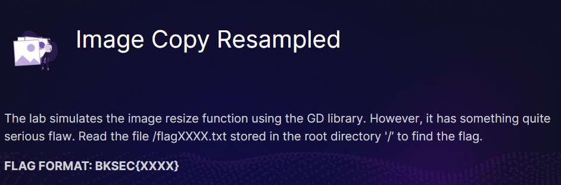
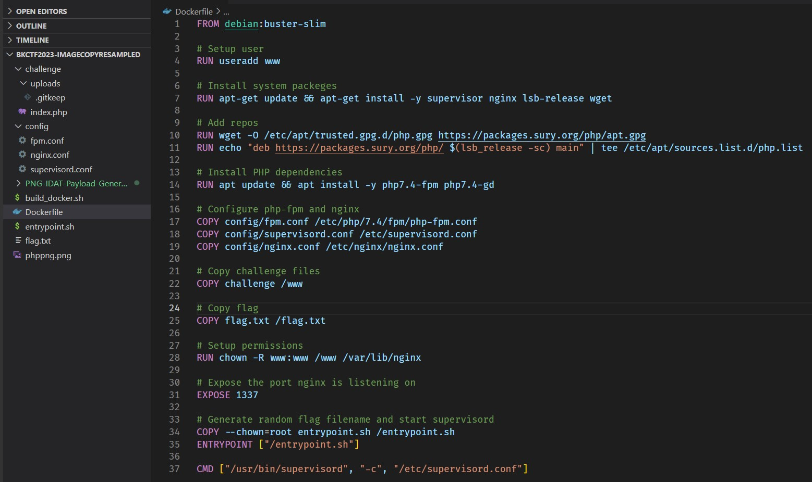
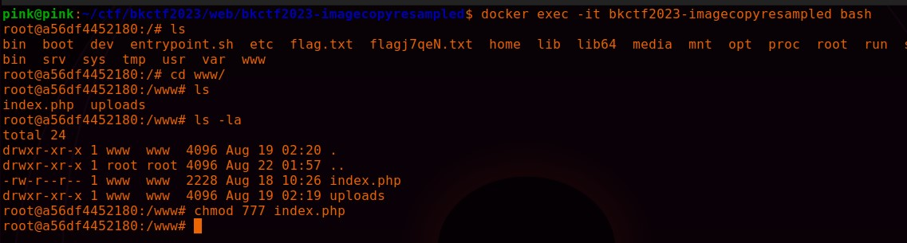
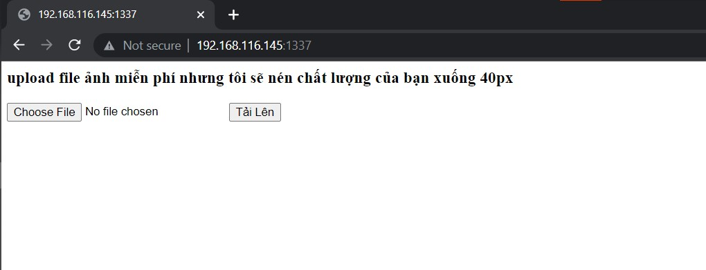
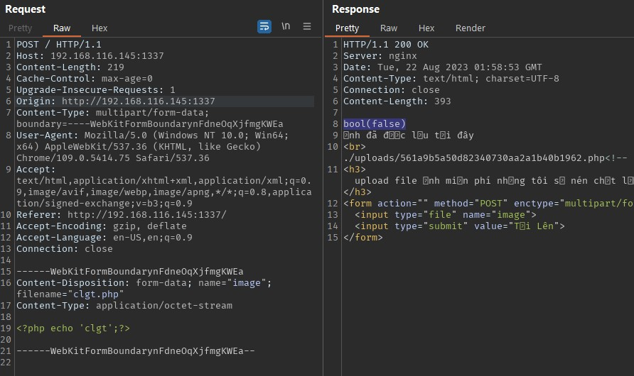
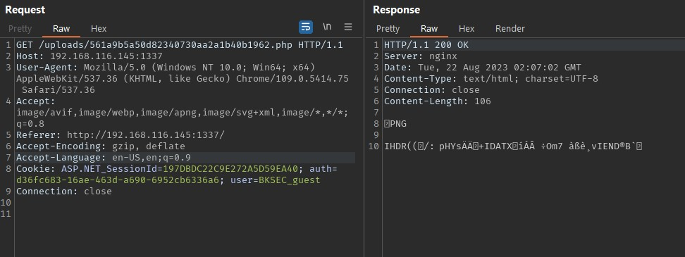
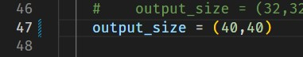
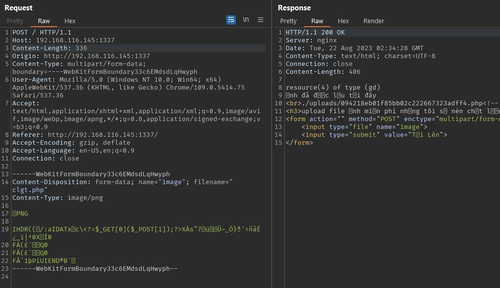
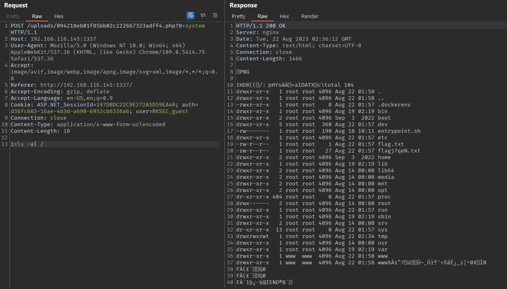

#####tl;dr: file upload, png idat chunks web shell

Bài có cho source code và docker
Từ Dockerfile có thể thấy ứng dụng chạy php7.4 trên nginx với fpm quen thuộc và có cài thêm gd extension, mọi thứ có vẻ bắt đầu phù hợp với description 


Các file config không có gì đặc biệt cần để ý, sau khi build docker, exec vào docker và sửa lại quyền một số file để tiện cho việc debug (do mình dùng docker extention trên vscode sẽ không có quyền root khi sửa file trong docker)


ta có giao diện sau


Có một chức năng upload file, cùng xem qua source code

```php
<?php
if(isset($_FILES['image'])){
    
    $upload_dir = "./uploads/";
    $file_name = $_FILES['image']['name'];
    $file_tmp = $_FILES['image']['tmp_name'];
    $file_type = $_FILES['image']['type'];
    $file_ext = strtolower(pathinfo($file_name, PATHINFO_EXTENSION));
    $size_check = getimagesize($file_tmp);

    $allowed_ext = array('jpg', 'png', 'php'); // -> chỉ cho upload file đuôi .jpg .png .php

    if(in_array($file_ext, $allowed_ext)){
        $image = imagecreatefromstring(file_get_contents($file_tmp));
        $cropped_image = imagecreatetruecolor(40, 40);
        imagecopyresampled($cropped_image, $image, 0, 0, 0, 0, 40, 40, imagesx($image), imagesy($image));
        $random_name = md5(uniqid(rand(), true));
        $new_file_name = $random_name . '.' . $file_ext;
        
        if ($file_ext === 'jpg' || $file_ext === 'png'  ) {
            //check size
            if ($size_check[0] < 40 || $size_check[1] < 40) { 
                echo "Ảnh của bạn hơi nhỏ. Chúng tôi cần ảnh lớn hơn 40x40 pixels\n<br>";
            } else {
                if($file_ext === 'jpg'){
                    imagejpeg($cropped_image, $upload_dir . $new_file_name);
                } else {
                    imagepng($cropped_image, $upload_dir . $new_file_name);
                }
                echo "ảnh đã được lưu tại đây\n<br>";
                echo $upload_dir;
                echo $new_file_name;  

                imagedestroy($image);
                imagedestroy($cropped_image);
            }
        } else {
            imagepng($cropped_image, $upload_dir . $new_file_name);
            echo "ảnh đã được lưu tại đây\n<br>";
            echo $upload_dir;
            echo $new_file_name;  

            imagedestroy($image);
            imagedestroy($cropped_image);
        }
    } else {        
        echo "Chỉ cho phép tải lên tệp JPG hoặc PNG và pHp ;D ? ? ?";
    }
}
?>
<!-- HTML Form để tải lên tệp -->
<h3>upload file ảnh miễn phí nhưng tôi sẽ nén chất lượng của bạn xuống 40px</h3>
<form action="" method="POST" enctype="multipart/form-data">
    <input type="file" name="image">
    <input type="submit" value="Tải Lên">
</form>

```
+ File sau khi upload sẽ trả về đường dẫn và có thể truy cập được
+ Sau khi upload file (.png .jpg hoặc .php), file của ta sẽ đi qua [imagecreatefromstring](https://www.php.net/manual/en/function.imagecreatefromstring.php), điều này khiến file gửi lên cần đúng các định dạng ảnh nhất định
```php
var_dump($image);
```


từ đó file cuối cùng trên server sẽ luôn có nội dung sau


Vậy bài này ta cần chèn web shell vào một file ảnh đuôi php do vì vậy không cần quan tâm tới luồng if .jpg .png nữa

+ Tuy nhiên file ảnh sẽ được đi qua [imagecopyresampled](https://www.php.net/manual/en/function.imagecopyresampled.php) để resize thành 40x40,
điều này sẽ khiến mất shell nếu chèn theo cách thông thường do nội dung file bị thay đổi

+ Ta có thể bypass việc này nếu chèn shell vào IDAT chunks của file png https://www.idontplaydarts.com/2012/06/encoding-web-shells-in-png-idat-chunks/

Để tạo payload ta có thể dùng tool sau https://github.com/huntergregal/PNG-IDAT-Payload-Generator/
chú ý cần sửa lại output size thành 40x40 hoặc lớn hơn 



`python3 generate.py -m php -o clgt` ta sẽ có file clgt.png, lúc upload lên sửa thành .php là được



